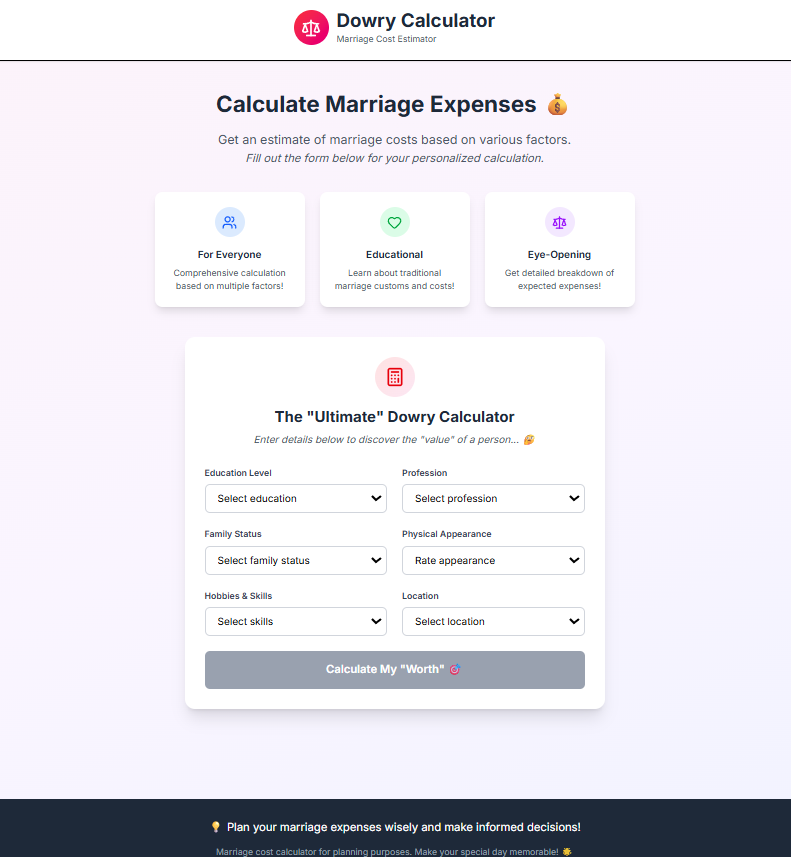

# 💍 Dowry Calculator – Marriage Cost Estimator

A fun and educational web app that estimates marriage costs based on multiple factors.  
Built with **React**, **Vite**, **TypeScript**, and **Tailwind CSS v4**.

## Live DEMO - https://dowry-calculator-plum.vercel.app/


---

## 📂 Project Structure
```plaintext
src/
 ├── components/     # React components
 ├── App.tsx         # Main App
 ├── index.css       # Tailwind styles + custom CSS
 ├── main.tsx        # Entry point
 ├── ...
public/              # Static assets
```

## ✨ Features
- 📊 **Interactive form** – Calculate "marriage cost" based on various inputs.  
- 🎨 **Modern UI** – Styled with Tailwind CSS v4.  
- 📱 **Responsive Design** – Works on mobile, tablet, and desktop.  
- 🧠 **Educational Purpose Only** – Not meant for actual dowry calculation in real life.  

---

## 🛠 Tech Stack
- **React 18** (with TypeScript)  
- **Vite** – Fast build tool  
- **Tailwind CSS v4** – Modern utility-first CSS  
- **PostCSS** – CSS transformation  

---

## 📦 Installation & Setup

### 1️⃣ Clone the repository
```bash
git clone https://github.com/YOUR_USERNAME/dowry-calculator.git
cd dowry-calculator
```

---

⚠ **Disclaimer**  
This project is for educational and entertainment purposes only.  
Dowry is illegal in many countries and should not be practiced.

---

📜 **License**  
MIT License © 2025 Sriram Chaitanya Seelam
